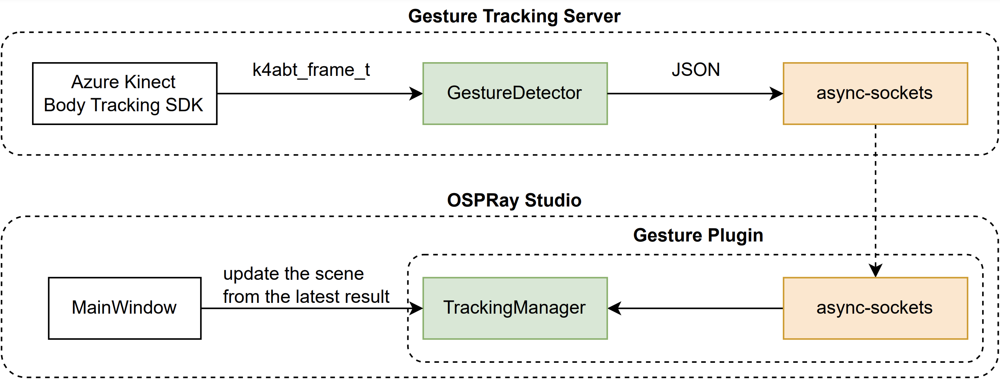

# Gesture Tracking Server
> This application is part of a project called [Immersive OSPray](../README.md).

The server application does three things:
1. gets body tracking data from a Microsoft Kinect sensor
2. parses the data (removing unnecessary information, e.g., orientations of joints)
3. sends the data to connected clients 

## Building Gesture Tracking Server
> As the application uses Azure Kinect Body Tracking SDK, it only runs in Windows.

> The application uses Microsoft [Kinect](https://github.com/microsoft/Azure-Kinect-Sensor-SDK/blob/develop/docs/usage.md), currently using v1.4.1. 

```
git clone https://github.com/jungwhonam-tacc/GestureTrackingServer.git

# switch to "windows" branch
git checkout windows

# create "build/release"
mkdir build
cd build
mkdir release

cmake \
-S .. \
-B release \
-DCMAKE_BUILD_TYPE=Release \
-DUSE_k4a=ON \
-Dk4a_DIR_PATH="C:/Program Files/Azure Kinect SDK v1.4.1/" \
-DUSE_k4abt=ON \
-Dk4abt_DIR_PATH="C:/Program Files/Azure Kinect Body Tracking SDK/"

cmake --build release

cmake --install release
```

CMake options to note (all have sensible defaults):

* Set the variable ```k4a_DIR_PATH``` to the folder where Azure Kinect SDK is installed, e.g., `C:/Program Files/Azure Kinect SDK v1.4.1/`. 
* Set the variable ```k4abt_DIR_PATH``` to the folder where Azure Kinect Body Tracking SDK is installed, e.g., `C:/Program Files/Azure Kinect Body Tracking SDK/`. Azure Kinect Body Tracking SDK requires Azure Kinect SDK.


## Implementation Details

In the figure, `Gesture Tracking Server` is connected to [OSPRay Studio](https://github.com/ospray/ospray_studio), a ray tracing application from Intel, to provide an interface to Microsoft's `Azure Kinect Body Tracking SDK`.

`k4abt_frame_t` is a struct from the SDK, and it contains `skeleton(s)` at the current frame. A `skeleton` contains a list of joints; each contains a position, an orientation, and a confidence level. 

`GestureDetector` extracts important information from `k4abt_frame_t`, and packages the information into a JSON format. It extracts positions and confidence levels of all the joints provided by the SDK. 

`async-sockets` opens a TCP socket and keeps track of connected clients. It sends the JSON string from `GestureDetector` to client(s).


## External Libraries
The server application uses four external libraries:
1. [Azure Kinect SDK (currently using v1.4.1)](https://github.com/microsoft/Azure-Kinect-Sensor-SDK/blob/develop/docs/usage.md)<br>```cmake/k4a.cmake``` looks for the library installed in your computer. 
2. [Azure Kinect Body Tracking SDK (currently using v1.1.2)](https://learn.microsoft.com/en-us/azure/kinect-dk/body-sdk-download)<br>```cmake/k4abt.cmake``` looks for the library installed in your computer.
3. [JSON for Modern C++ (currently using v3.10.4)](https://github.com/nlohmann/json)<br>It's a header-only library. v3.10.4 is used as it is the same version used by rkcommon, one of dependencies for OSPRay Studio. The library is placed under ```external/json```.
4. [async-sockets (using the version from the last commit on 2/21/2022)](https://github.com/eminfedar/async-sockets-cpp)<br>We use this library for TCP networking. We update the library to support Windows. This is a header-only library, and is placed under ```external/async-sockets```.


## Future Work
We plan to use Git Submodules for 
[JSON for Modern C++](https://github.com/nlohmann/json) and [async-sockets](https://github.com/eminfedar/async-sockets-cpp). Currently, these two repos are copied to ```external/json```.